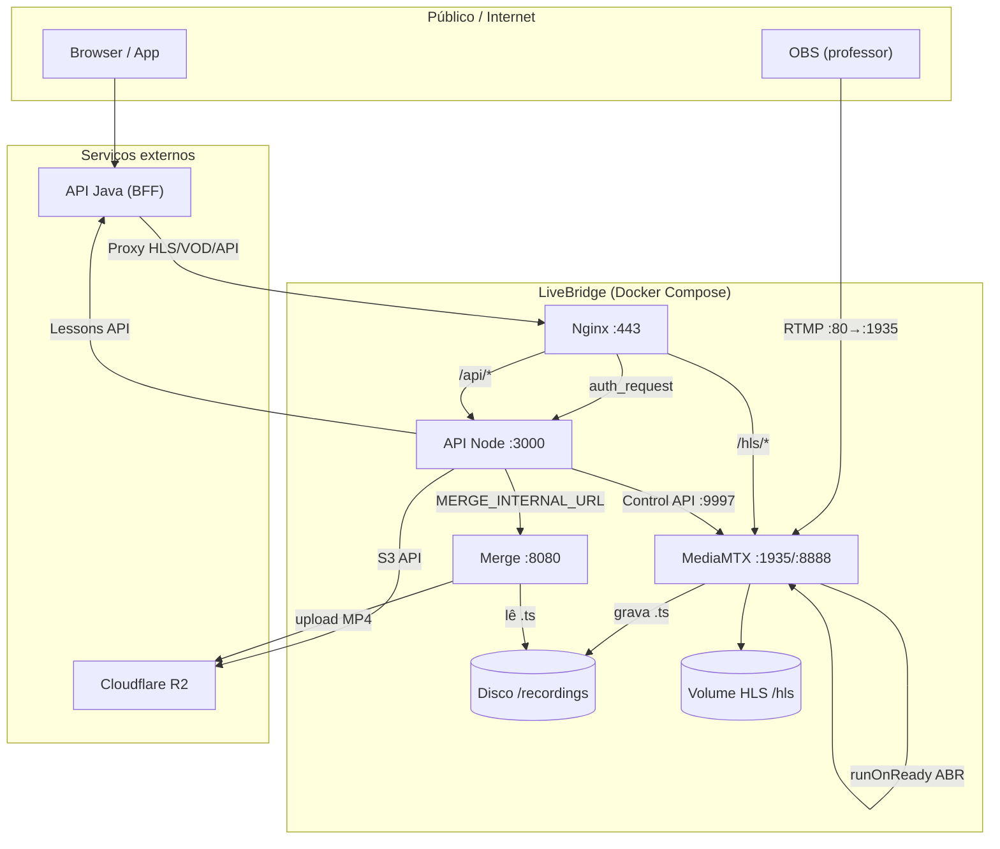

# LiveBridge — Análise de Stack e Arquitetura

Documento de referência para revisão técnica, onboarding e decisões de infraestrutura. Descreve **o que** o sistema é, **como** os componentes se relacionam e **quais** tecnologias sustentam cada camada.

**Última revisão:** junho/2026 · **Repositório:** `livebridge` · **Produto:** servidor de streaming ao vivo (HLS) e gravações de aulas, integrado à plataforma Posiplay.

---

## 1. Resumo executivo

O **LiveBridge** (também referido como **PosiLive** na documentação de negócio) é um **serviço de mídia** auto-hospedado que:

1. Recebe ingestão **RTMP** (OBS) via **MediaMTX**
2. Transmite ao vivo em **HLS** com **ABR** (1080p / 720p / 480p)
3. Grava segmentos `.ts` em disco durante a transmissão
4. Após o fim da sessão, **concatena, comprime e envia** MP4(s) para **Cloudflare R2**
5. Expõe uma **API REST Node.js** para listagem, playback, metadados e controle de acesso

Na arquitetura de produção da Posiplay, o **browser não fala diretamente com o LiveBridge**: o **frontend** consome a **API Java (Spring)**, que atua como **BFF** — valida sessão, emite JWT, faz proxy de HLS/VOD e encaminha chamadas ao LiveBridge na rede interna.

**Exceção:** o professor publica RTMP **diretamente** no endpoint de ingestão do LiveBridge (`rtmp://HOST:80/live`) com **token de publish** (`RTMP_PUBLISH_TOKEN` no `.env` + chave OBS `NOME?token=...`).

---

## 2. Stack tecnológica

### 2.1 Visão por camada

| Camada | Tecnologia | Versão / imagem | Função |
|--------|------------|-----------------|--------|
| Orquestração | Docker Compose | — | 4 serviços core + stack opcional de observabilidade |
| Ingest / streaming | MediaMTX | `bluenviron/mediamtx:1.11.3-ffmpeg` | RTMP :1935, HLS :8888, Control API :9997, métricas :9998 |
| Transcoding live (ABR) | FFmpeg (no container MediaMTX) | via `transcode-abr.sh` | 3 variantes RTMP derivadas (1080/720/480) |
| Proxy reverso / TLS | Nginx | `nginx:alpine` | HTTPS :443, HTTP interno :8080, auth HLS, cache de segmentos |
| API de integração | Node.js + Express | Node 22 Alpine | REST, JWT, proxy R2, orquestração merge |
| Pós-processamento | Node.js + FFmpeg | Node 22 Bookworm + ffmpeg | Concatenação, encode H.264/H.265, upload multipart R2 |
| Armazenamento objeto | Cloudflare R2 | API S3-compatível | MP4 finais (`recordings/videos/...`) |
| Metadados acadêmicos | API Java (externa) | Spring Boot | Títulos, professor, matéria, cursos, flag `ativo` |
| CI/CD | GitHub Actions | publish imagens `api`/`merge` no **GHCR**; deploy manual na VM |
| Observabilidade (opcional) | Prometheus, Grafana, Loki, Alertmanager, exporters | ver `docker-compose.observability.yml` | Métricas, logs, alertas, dashboards |

### 2.2 Dependências Node.js (API)

| Pacote | Uso |
|--------|-----|
| `express` | Servidor HTTP e roteamento |
| `@aws-sdk/client-s3` | Listagem, leitura e exclusão no R2 |
| `jsonwebtoken` | Validação de tokens JWT (live e VOD) |
| `cookie-parser` | Cookies `vid_ctx` e `vid_live` |
| `cors` | CORS configurável por origem |
| `compression` | Gzip em respostas JSON |
| `prom-client` | Métricas Prometheus (`/metrics`) |
| `dotenv` | Variáveis de ambiente em dev |

### 2.3 Dependências Node.js (Merge)

| Pacote | Uso |
|--------|-----|
| `express` | Endpoints internos (`/merge`, `/health`, progresso) |
| `@aws-sdk/client-s3` + `@aws-sdk/lib-storage` | Upload multipart para R2 |

### 2.4 Runtime e recursos (Docker Compose padrão)

| Serviço | CPU (limite) | RAM (limite) | Notas |
|---------|--------------|--------------|-------|
| `mediamtx` | 8 cores | 10 GB | Prioridade CPU (`cpu_shares: 1024`); ABR em tempo real |
| `merge` | 4 cores | 8 GB | Encode HEVC `veryslow`; `cpu_shares: 256` |
| `api` | 2 cores | 3 GB | Cluster Node opcional (`CLUSTER_WORKERS=auto`) |
| `nginx` | 1,5 cores | 2 GB | Cache HLS em volume `nginx-hls-cache` |

---

## 3. Arquitetura de alto nível

### 3.1 Diagrama de componentes



### 3.2 Padrão arquitetural

| Aspecto | Padrão adotado |
|---------|----------------|
| Deploy | **Monólito distribuído** — serviços acoplados por Compose, sem Kubernetes |
| API | **REST stateless** com cache em memória (paths MediaMTX, auth HLS, lessons) |
| Storage | **Object storage** (R2) para VOD; **filesystem local** para buffer de gravação |
| Segurança | **BFF Java** + JWT compartilhado (`VIDEO_ACCESS_SECRET`) + `auth_request` nginx |
| Streaming live | **Publisher-subscriber** (MediaMTX) + **transcoding sidecar** (FFmpeg ABR) |
| Pós-live | **Worker assíncrono** (merge) com scan periódico e jobs concorrentes limitados |

---

## 4. Componentes e responsabilidades

### 4.1 MediaMTX

**Papel:** coração do streaming — recebe RTMP, serve HLS, grava ingest principal.

| Responsabilidade | Detalhe |
|------------------|---------|
| Ingest RTMP | Path `live/<nome>` (regex `~^live/[^/]+$`) |
| ABR live | `runOnReady: transcode-abr.sh` gera `live/<nome>_1080`, `_720`, `_480` |
| Gravação | Segmentos `.ts` de 60s em `/recordings/live/<nome>/<timestamp>/` |
| HLS DVR | ~8h de buffer (7200 segmentos × 4s), disco em volume `mediamtx-hls` |
| Auth publish | HTTP hook `POST /api/internal/mediamtx-auth` — só rede Docker publica |
| Leitura HLS | Sem auth no MTX; proteção na borda (nginx + JWT) |

**Arquivos-chave:** `server/mediamtx/mediamtx.yml`, `server/mediamtx/transcode-abr.sh`

### 4.2 Nginx

**Papel:** único ponto de entrada HTTP(S) para usuários e proxy interno.

| Rota | Destino | Observação |
|------|---------|------------|
| `/api/*` | `api:3000` | Repassa cookies, Range, CORS |
| `/hls/*`, `/api/hls/*` | `mediamtx:8888` | `auth_request` → `/api/check-video-access` |
| `/merge-api/*` | `merge:8080` | Operações manuais de merge |
| `/internal/livebridge-hls-probe/` | MediaMTX | Sonda interna (readiness HLS) |
| `:443` | TLS com certs em `./certs` | |
| Host `:80` | Redirect 301 → HTTPS | **No host, porta 80 é RTMP** (mapeada para MTX :1935) |

**Arquivos-chave:** `server/nginx/nginx.conf`, `server/nginx/includes/hls-ts-locations.conf`

### 4.3 API Node.js

**Papel:** orquestração, integração R2/Java, autenticação de mídia, master playlists.

**Estrutura de código:**

```
server/api/
├── app.js              # Express app, CORS, rotas
├── server.js           # Cluster workers, listen
├── config.js           # Constantes e env
├── routes/
│   ├── live.js         # init, check-video-access, transmissões, hls-master
│   ├── recordings.js   # CRUD gravações, HLS VOD, lesson-boundary
│   ├── catalog.js      # Proxy professores/materias/cursos
│   ├── health.js       # /api/health, /api/ready
│   └── mediamtxHttpAuth.js
├── services/           # R2, MediaMTX, lessons, disk, liveHlsReady
├── middleware/         # auth, métricas Prometheus
└── lib/                # JWT, cookies, asyncPool
```

**Rotas principais:**

| Grupo | Endpoints | Autenticação |
|-------|-----------|--------------|
| Live | `GET /api/live/transmissoes`, `GET /api/live/hls-master.m3u8`, `POST /api/init-live` | JWT live (`vid_live`) |
| Auth HLS | `GET /api/check-video-access` | Cookie ou JWT (nginx auth_request) |
| Gravações | `GET /api/recordings`, `GET /api/recordings/video`, HLS VOD | JWT VOD ou cookie |
| Operações | `POST /api/recordings/lesson-boundary`, `GET /api/recordings/pending` | Token interno / rede Docker |
| Catálogo | `GET /api/professores`, `/materias`, `/frentes`, `/cursos` | Proxy Java |
| Saúde | `GET /api/health`, `GET /api/ready` | Público (rede interna) |

### 4.4 Merge

**Papel:** pós-processamento de gravações — detecta sessões finalizadas, encoda e envia ao R2.

| Comportamento | Valor padrão |
|---------------|--------------|
| Detecção de fim | 2 min sem novos `.ts` (stale session) |
| Scan | A cada 30s (`MERGE_SCAN_INTERVAL_MS`) |
| Resoluções | 1080, 720, 480 → 3 MP4 no R2 |
| Codec | HEVC (`h265`), preset `veryslow`, CRF 28, AAC 64k |
| Concorrência | Até 3 jobs (`MERGE_MAX_CONCURRENT_JOBS`) |
| Callback | `MERGE_CALLBACK_URL` → API (`/api/recordings/upload-complete`) |

**Arquivos-chave:** `server/merge/server.js`, `server/merge/lib/`

### 4.5 Cloudflare R2

**Estrutura de objetos:**

```
recordings/videos/live/<stream>/<session>_1080.mp4
recordings/videos/live/<stream>/<session>_720.mp4
recordings/videos/live/<stream>/<session>_480.mp4
```

**Modos de playback:**

| Modo | Variável | Comportamento |
|------|----------|---------------|
| Proxy API (padrão) | `USE_PRESIGNED=0` | API faz stream do objeto; sem CORS no R2 |
| URLs presignadas | `USE_PRESIGNED=1` | Browser acessa R2 direto; exige CORS no bucket |

---

## 5. Fluxos de dados

### 5.1 Transmissão ao vivo (professor → aluno)

```
OBS ──RTMP──► MediaMTX (live/nome)
                  │
                  ├─► transcode-abr.sh ──► live/nome_1080|720|480
                  ├─► HLS segments ──► volume /hls
                  └─► grava .ts ──► /recordings/live/nome/...

Aluno: Browser → Java BFF → init-live (JWT) → cookie vid_live
     → Java proxy HLS → Nginx → auth_request → API check-video-access
     → MediaMTX HLS (main_stream.m3u8 + segmentos .ts)
```

**Master playlist ABR:** `GET /api/live/hls-master.m3u8` retorna variantes com bandwidths definidos em `config.js` (1080: 4,6 Mbps, 720: 2,9 Mbps, 480: 1,3 Mbps).

### 5.2 Gravação e pós-processamento

```
Durante live: MediaMTX grava .ts (60s cada) em subpasta por sessão

Fim detectado: merge scan (2min stale) OU POST lesson-boundary (corte manual)

Merge: concat .ts → FFmpeg encode (1–3 resoluções) → upload multipart R2
     → callback upload-complete → API invalida cache

Aluno VOD: Java → GET /api/recordings → enriquecimento metadata (Lessons API)
          → playback via /api/recordings/video ou HLS VOD (/api/recordings/hls/*)
```

### 5.3 Lesson boundary (múltiplas aulas na mesma live)

Permite **cortar** uma transmissão longa em várias aulas sem parar o OBS:

1. `POST /api/recordings/lesson-boundary` — cria hardlinks/cópias dos `.ts` desde o último corte
2. Dispara merge da aula anterior (com delay `LESSON_BOUNDARY_MERGE_DELAY_MS` para não degradar HLS)
3. Continua gravando a próxima aula no mesmo stream RTMP

---

## 6. Integrações externas

### 6.1 API Java (Posiplay)

| Integração | Direção | Propósito |
|------------|---------|-----------|
| Lessons API | LiveBridge → Java | `GET` lessons para enriquecer listagem |
| Metadata | LiveBridge → Java | `PUT` título, professor, matéria, etc. |
| BFF / Proxy | Java → LiveBridge | HLS live, VOD, init-live, listagens |
| JWT | Java ↔ LiveBridge | `VIDEO_ACCESS_SECRET` compartilhado |

**Variáveis:** `LESSONS_API_URL`, `LESSONS_API_TOKEN`, `API_PUBLIC_BASE_URL`

### 6.2 Frontend

O repositório **não inclui** o frontend de produção (Posiplay). Há apenas `server/static/index.html` mínimo. Integração documentada em:

- `docs/Frontend-Externo.md`
- `docs/GUIA_PLAYER_FRONT_DO_ZERO.md`
- `docs/API_FRONTEND.md`

---

## 7. Infraestrutura e deploy

### 7.1 Portas expostas (host)

| Porta | Protocolo | Serviço | Exposto à internet |
|-------|-----------|---------|-------------------|
| 80 | RTMP | MediaMTX (→ :1935) | Sim (ingest OBS) |
| 443 | HTTPS | Nginx | Sim (API, HLS) |
| 127.0.0.1:8081 | HTTP | Nginx (dev local) | Não |
| 127.0.0.1:8082 | HTTP | Merge | Não |
| 3000, 8888, 9997 | — | API, HLS MTX, Control API | Só rede Docker |

### 7.2 CI/CD

**Workflow:** `.github/workflows/deploy-livebridge.yml`

- Trigger: push em `main` (paths `server/**`) ou `workflow_dispatch`
- Ação: SSH no servidor → `git pull` → `docker compose build` → `up -d`
- Secrets: `SSH_HOST`, `SSH_USER`, `SSH_PRIVATE_KEY`, `DEPLOY_PATH`

### 7.3 Volumes e persistência

| Volume / path | Conteúdo | Crítico |
|---------------|----------|---------|
| `./recordings` | `.ts` em gravação, progresso merge, boundaries | Sim (durante live) |
| `mediamtx-hls` | Segmentos HLS live | Recriável |
| `nginx-hls-cache` | Cache de `.ts` no proxy | Recriável |
| `./certs` | TLS (fullchain.pem, privkey.pem) | Sim (produção) |
| R2 | MP4 finais | **Fonte da verdade** para VOD |

---

## 8. Observabilidade

Stack **opcional** via `docker-compose.observability.yml`:

| Ferramenta | Porta | Função |
|------------|-------|--------|
| Grafana | 3001 | Dashboards (`livebridge-overview`, `livebridge-logs`) |
| Prometheus | 9090 | Scraping API `/metrics`, MediaMTX :9998, node-exporter, cAdvisor |
| Alertmanager | 127.0.0.1:9093 | Alertas (`prometheus/alerts.yml`) |
| Loki + Promtail | interno | Logs de containers Docker |
| Blackbox exporter | interno | Probes HTTP/HTTPS |

**Nota:** com `CLUSTER_WORKERS > 1`, métricas Prometheus ficam inconsistentes; observability força `CLUSTER_WORKERS=1`.

---

## 9. Segurança

### 9.1 Modelo de confiança

```
Internet ──► Nginx (TLS) ──► auth_request ──► API (JWT/cookie)
                │
                └──► MediaMTX HLS (leitura aberta na rede interna)

Rede Docker ──► MediaMTX publish auth (IP interno)
             ──► Merge/API sem exposição pública direta
```

### 9.2 Mecanismos

| Recurso | Mecanismo |
|---------|-----------|
| HLS live | Cookie `vid_live` com JWT assinado por Java |
| VOD / gravações | Query `token` JWT ou cookie `vid_ctx` |
| Publish RTMP | Hook HTTP — só IPs da rede Docker |
| API administrativa | `API_ACCESS_TOKEN` / `LESSONS_API_TOKEN` |
| CORS | Lista explícita em `CORS_ORIGINS` |

### 9.3 Superfície de ataque

| Exposto | Risco | Mitigação |
|---------|-------|-----------|
| RTMP :80 | Publicação não autorizada se hook falhar | Auth HTTP no publish; firewall |
| HTTPS :443 | Acesso a HLS sem token | `auth_request` + JWT |
| R2 bucket | URLs diretas se presigned | Proxy padrão; CORS restrito se presigned |

---

## 10. Trade-offs e pontos de atenção

### 10.1 CPU e concorrência

- **ABR live** (3× x264) e **merge HEVC** disputam CPU no mesmo host
- `cpu_shares` favorece MediaMTX; merge usa preset lento fora do horário crítico
- `LESSON_BOUNDARY_MERGE_DELAY_MS` evita degradar HLS ao iniciar encode

### 10.2 Latência HLS

- Segmentos de **4s** (latência ~10–12s; nginx faz cache de `.ts`)
- DVR de **8h** exige disco (volume `mediamtx-hls`), não RAM

### 10.3 Escalabilidade

| Dimensão | Limite atual | Caminho de evolução |
|----------|--------------|---------------------|
| Streams simultâneos | 1 VM, CPU-bound | VPS maior; separar merge em outro host |
| Armazenamento | R2 (ilimitado prático) | Lifecycle rules, Infrequent Access |
| API | Cluster Node até 32 workers | Load balancer + sticky sessions para cache |
| Alta disponibilidade | Single-node Compose | Kubernetes, MediaMTX cluster, R2 multi-region |

### 10.4 Dependências externas

- **API Java indisponível:** listagem sem metadata; gravações R2 continuam
- **R2 indisponível:** live funciona; VOD e upload falham
- **Certificado TLS:** autoassinado em dev; Let's Encrypt em produção (`docs/SSL_LETSENCRYPT.md`)

---

## 11. Mapa do repositório

```
livebridge/
├── server/
│   ├── docker-compose.yml          # Stack principal
│   ├── docker-compose.observability.yml
│   ├── api/                        # API Node.js
│   ├── merge/                      # Pós-processamento FFmpeg
│   ├── mediamtx/                   # Config streaming + ABR script
│   ├── nginx/                      # Proxy TLS e HLS
│   ├── static/                     # HTML estático mínimo
│   ├── grafana/, prometheus/, loki/  # Observabilidade
│   ├── scripts/                    # SSL, sync R2, checks
│   └── recordings/                 # Dados locais (gitignored)
├── docs/                           # Documentação de API e integração
├── .github/workflows/              # CI/CD
├── README.md                       # Início rápido
├── DOCUMENTACAO_TECNICA.md         # Detalhamento arquivo a arquivo
└── MANUTENCAO.md                   # Operação e troubleshooting
```

---

## 12. Documentação relacionada

| Documento | Público-alvo | Conteúdo |
|-----------|--------------|----------|
| `README.md` | Dev/Ops | Quick start, portas, OBS |
| `DOCUMENTACAO_TECNICA.md` | Dev | Código e config linha a linha |
| `MANUTENCAO.md` | Ops | Troubleshooting |
| `docs/PosiLive-Visao-Geral-Custos-e-Arquitetura.md` | Gestão + técnico | Custos R2, comparação cenários |
| `docs/API_LIVE.md` | Integração | Live, proxy Java |
| `docs/API_JAVA_SECURITY.md` | Integração | JWT, check-video-access |
| `docs/Frontend-Externo.md` | Frontend | Integração Angular/React/Vue |
| `docs/API_ROUTES.md` | Referência | Rotas completas |

---

## 13. Checklist de análise rápida

Use este checklist ao avaliar o sistema para um novo ambiente ou auditoria:

- [ ] `.env` com credenciais R2 e `VIDEO_ACCESS_SECRET` alinhado com Java
- [ ] Firewall: apenas TCP 80 (RTMP) e 443 (HTTPS) na internet
- [ ] Certificados TLS válidos em `server/certs/`
- [ ] `LESSONS_API_URL` apontando para Java acessível do container API
- [ ] Recursos de VM: ≥8 vCPU e ≥16 GB RAM recomendados para live + merge
- [ ] Volume `./recordings` com espaço para buffer de gravação (horas de aula)
- [ ] OBS configurado: 720p, keyframe 2s, RTMP `rtmp://HOST:80/live/NOME`
- [ ] Observabilidade habilitada em produção (`docker-compose.observability.yml`)
- [ ] Backup: R2 é fonte da verdade; metadata no Java

---

*Documento gerado para análise de stack e arquitetura do LiveBridge. Para alterações de implementação, consulte o código em `server/` e a documentação técnica detalhada.*
