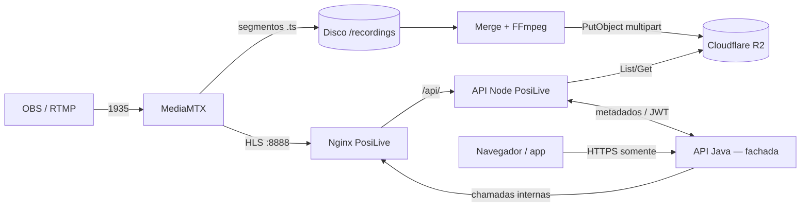

# PosiLive — Visão geral, custos (R2) e arquitetura

Documento único com duas leituras: uma **introdução em linguagem simples** para gestores e equipes não técnicas, e uma **parte técnica** com stack, arquitetura, segurança e operação. Os valores de preço do Cloudflare R2 citados abaixo correspondem à documentação oficial [1] — confira sempre o site da Cloudflare antes de orçamentos formais, pois preços e faixas gratuitas podem mudar.

---

## Parte 1 — Para quem não é da área técnica

### O que é o PosiLive?

É o **“motor de transmissão e gravação”** por trás das aulas ao vivo: recebe o vídeo que o professor envia (geralmente pelo OBS), transforma em formato adequado para assistir na internet **em tempo quase real**, grava a aula em pedaços no servidor e, depois que a transmissão termina, **junta tudo em arquivo de vídeo**, pode **comprimir** para ocupar menos espaço e **envia para a nuvem** (Cloudflare R2), de onde os alunos podem assistir depois.

O **site ou aplicativo** onde o aluno interage **não conversa com o PosiLive diretamente**. Na arquitetura de referência, **todo tráfego do usuário (navegador ou app)** passa pela **API Java**, que **abstrai** o PosiLive: listagens, permissões, tokens e encaminhamento (ou proxy) para streaming e VOD. O PosiLive atua como **serviço de mídia** acessível **à camada Java** (rede interna, BFF ou padrão equivalente), não como origem exposta ao browser.

**Exceção operacional:** quem **publica** a live (OBS) envia RTMP para o **endpoint de ingestão** do PosiLive — isso não passa pela API Java; já **quem assiste** não aponta o browser diretamente às rotas do PosiLive.

### O que o sistema faz, passo a passo (em linguagem simples)

1. **Professor transmite** — Usa um programa como o OBS e envia o vídeo para o servidor do PosiLive.
2. **Quem está online assiste ao vivo** — O vídeo é entregue em formato adaptado para navegadores (HLS), com possibilidade de “voltar no tempo” durante a live (como em transmissões longas).
3. **O sistema grava a aula** — Enquanto a transmissão acontece, são guardados trechos do vídeo no disco do servidor.
4. **Quando a aula acaba** — Após um período sem novos trechos (por exemplo, alguns minutos), o sistema entende que a sessão terminou, **concatena** os trechos, **opcionalmente recompacta** o vídeo (para arquivo menor) e **sobe para o armazenamento em nuvem** R2.
5. **Alunos e sistema acadêmico** — A **API Java** lista gravações, valida sessão do usuário e entrega ao frontend **URLs ou fluxos** já autorizados; o PosiLive é acionado **por trás** dessa camada. Títulos e metadados da aula permanecem na **API Java** (ou fonte que ela integra).

### O que fica fora deste projeto

- **Interface completa do usuário** (telas, login, catálogo): fica no **frontend** que chama **somente a API Java**; o aluno **não** configura host do PosiLive. No repositório do PosiLive podem existir apenas artefatos auxiliares (ex.: estático mínimo para testes) e a **API Node** voltada ao **encadeamento com a Java**, não ao consumo direto pelo browser.
- **Custo do servidor (VPS), domínio, certificado e equipe** não são “preço do R2”; o R2 cobra principalmente **armazenamento** e **operações** sobre os arquivos (veja a Parte 2).

### Estimativa de custo — Cloudflare R2 (visão simples)

O R2 é o **armazenamento em nuvem** onde ficam os vídeos finais (MP4). Em termos simples:

| Conceito | O que significa |
|----------|------------------|
| **Armazenamento** | Quanto “soma” de vídeo você guarda no mês (medido em GB-mês). Quanto mais horas de aula e mais qualidade, maior o volume. |
| **Saída para a internet (egress)** | No R2, **não há cobrança de tráfego de saída** para a internet no modelo descrito na documentação oficial [1] — é um dos atrativos em relação a outros provedores. |
| **Operações** | Cada vez que o sistema **lista**, **lê** ou **grava** um objeto no bucket, conta como operação (classes A e B, com preços diferentes). Uso intenso de listagem ou leitura pode aumentar o custo além do armazenamento. |
| **Camada gratuita** | A Cloudflare oferece uma faixa mensal grátis (armazenamento e operações); projetos pequenos podem ficar dentro dela [1]. |

**Exemplo ilustrativo (não é orçamento):**  
Suponha **100 GB** de vídeos armazenados o mês inteiro, em armazenamento **Standard**, e que você já **esgotou** a faixa gratuita de armazenamento.

- Preço de referência (documentação oficial [1]): **US$ 0,015 por GB-mês** de armazenamento Standard.  
- 100 GB-mês × 0,015 ≈ **US$ 1,50/mês** só de armazenamento.

Na prática o custo total R2 também depende de:

- Quantos **vídeos novos** são enviados por mês (cada upload usa operações classe A).
- Quantas vezes os alunos **abrem e assistem** (leituras — classe B).
- Se o merge gera **um ou vários arquivos por aula** (por exemplo, 1080p, 720p e 480p multiplicam o armazenamento).

**Conversão para reais:** multiplique o valor em dólares pela cotação do dia e pelos impostos/tarifas da sua fatura Cloudflare.

**Recomendação:** use a calculadora oficial R2 [2] e monitore o painel de uso no dashboard Cloudflare após os primeiros meses em produção.

### Comparação com a operação hoje (referência interna)

A tabela abaixo resume **prós e contras** entre o **cenário atual** (como a operação está organizada hoje) e a **abordagem PosiLive** (transmissão própria + armazenamento R2 + integração com seu sistema). Os dados do “hoje” são **premissas de negócio e de infraestrutura** para discussão; o valor mensal da plataforma atual é **dedução interna, ainda não comprovado** por fatura ou auditoria independente.

**Premissas usadas nesta comparação**

| Premissa | Valor ou descrição |
|----------|-------------------|
| Transmissão ao vivo | **YouTube** |
| Vídeos gravados / VOD | **URLs expostas** (links diretos ou pouco controlados em relação a quem acessa) |
| Nuvem de objetos / serviços | Uso de **AWS** (ecossistema atual) |
| Custo da plataforma atual (ordem de grandeza) | **~R$ 45.000,00/mês** — *hipótese deduzida; não consolidado com comprovante neste documento* |
| Acervo de vídeos | **Sem compactação** (arquivos maiores → mais armazenamento e, em muitos modelos, mais tráfego) |
| Volume da base hoje | **~13 TB** de conteúdo |

**Ordem de ideia para 13 TB só em armazenamento R2 (Standard, referência [1]):** 13.000 GB-mês × US$ 0,015 ≈ **US$ 195/mês** *apenas* linha de armazenamento — sem incluir free tier, operações classe A/B, class Infrequent Access, impostos ou serviços adjacentes. **Não** equivale ao custo total da operação PosiLive (há VPS, tráfego fora do R2, equipe, etc.). Serve para contrastar com um acervo **sem compactação** em outro provedor: quanto maior o TB sem otimização de codec/bitrate, maior tende a ser o gasto com armazenamento e transferência onde estas forem cobradas.

#### Prós e contras (síntese)

| Critério | **Cenário atual (YouTube + AWS / plataforma atual)** | **PosiLive (RTMP/HLS + R2 + API própria)** |
|----------|------------------------------------------------------|-------------------------------------------|
| **Prós** | Equipe e professores já **acostumados com YouTube** para ir ao ar; **infraestrutura AWS** amplamente documentada e com muitos serviços; em geral **menos responsabilidade operacional** sobre o “player” de live do que hospedar tudo em VPS próprio. | **Um único ponto de entrada para o usuário: a API Java** — o browser **não** chama o PosiLive diretamente; **controle de acesso** centralizado na Java (JWT, sessão, políticas), com PosiLive **atrás** dessa abstração; **egress do R2** sem cobrança de saída para a internet no modelo oficial [1]; **compactação configurável** (ex.: H.265 + AAC); **custo de armazenamento objeto** previsível [1][2]. |
| **Contras** | **URLs de vídeo expostas** elevam risco de compartilhamento indevido e dificultam política única de “só aluno matriculado”; **custo percebido como alto** (ordem de **R$ 45k/mês** na premissa acima — a confirmar); **dependência** de políticas e UI do YouTube para live; acervo **sem compactação** em **~13 TB** tende a **pressionar custo** de storage e transferência em nuvem tradicional; **AWS** pode ficar **cara** conforme egress, requests e serviços acoplados. | **Operação própria**: VPS, firewall, certificados, atualizações, monitoramento; **curva de aprendizado** OBS → RTMP PosiLive; **migração** de grande volume (**13 TB**) exige planejamento (tempo, banda, validação); encode no **merge** consome **CPU** (especialmente HEVC + preset lento); **responsabilidade** de segurança e backup com a equipe interna. |

#### Leitura para decisão

- Se a prioridade é **reduzir dependência de URLs abertas** e alinhar **playback** ao **login/acesso** via **API Java** (sem expor o host do PosiLive ao browser), o desenho **Java + PosiLive** tende a ser **favorável**.
- Se a prioridade é **zero operação de servidor** e aceita-se **menos controle** sobre link e política de exibição, manter **YouTube + fluxo atual** pode parecer **mais simples** no curto prazo — ao custo das premissas de **custo** e **exposição** acima.
- O valor **R$ 45.000,00/mês** deve ser **validado com financeiro e faturas** antes de constar em contrato ou relatório oficial; aqui entra apenas como **referência de discussão**.

---

## Parte 2 — Documentação técnica

### 2.1 Stack e tecnologias

| Camada | Tecnologia |
|--------|------------|
| Orquestração | **Docker Compose** — serviços `mediamtx`, `merge`, `api`, `nginx` |
| Streaming RTMP/HLS | **MediaMTX** (imagem `bluenviron/mediamtx`, variante `latest-ffmpeg` para transcoding ABR) |
| Proxy reverso / TLS | **Nginx** (`nginx:alpine`), certificados em volume `./certs` |
| API e integração R2 | **Node.js**, **Express**, cookies, **JWT** (`jsonwebtoken`), **AWS SDK v3** (`@aws-sdk/client-s3`) compatível com API S3 do R2 |
| Pós-processamento | **FFmpeg** (dentro do serviço merge) — concatenação, H.264/H.265, AAC |
| Armazenamento objeto | **Cloudflare R2** (endpoint S3: `https://<ACCOUNT_ID>.r2.cloudflarestorage.com`) |
| Fachada para browser / app | **API Java** — todo acesso do **usuário final** passa por ela; o PosiLive **não** é origem direta para o navegador |
| Integração PosiLive ↔ Java | API **Java** (aulas, metadados, emissão de JWT) e API **Node** do PosiLive (`LESSONS_API_URL`, `VIDEO_ACCESS_SECRET`, etc.) |

### 2.2 Arquitetura lógica

Na operação desejada, o **navegador** fala **somente** com a **API Java**. A Java **abstrai** rotas de listagem, playback, live e tokens; por baixo chama o **stack PosiLive** (Nginx + API Node + MediaMTX) em rede **servidor a servidor** ou padrão equivalente (BFF, API gateway interno, proxy reverso com roteamento só no backend).

Fluxo resumido:

- **OBS** publica em `rtmp://host:1935/live/<nome>` **direto no PosiLive** (ingestão RTMP não passa pela API Java).
- **MediaMTX** gera HLS internamente e grava MPEG-TS em `/recordings` por sessão.
- **Nginx** do PosiLive expõe `/hls/`, `/api/`, estáticos e proxy para merge — **consumo pelo browser** ocorre **somente** se a arquitetura expuser esse host; no desenho de referência, **quem consome** é a **API Java** (proxy/stream) ou o Java **repassa** URLs restritas ao cliente, **sem** tratar o PosiLive como “site público” do aluno.
- **Merge** detecta sessões “paradas” (sem novos `.ts` há ~2 minutos), concatena, comprime opcionalmente, faz upload multipart ao R2 e pode gerar **múltiplas resoluções** (`MERGE_RESOLUTIONS`, ex.: `1080,720,480`).
- **API Node** (PosiLive) lista objetos no R2, faz proxy de vídeo (ou URLs pré-assinadas com `USE_PRESIGNED`), integra metadados com a API Java; **JWT** de vídeo/live, quando `VIDEO_ACCESS_SECRET` está ativo, é **emitido pela Java** e validado no PosiLive [5].

### 2.3 Componentes principais

#### MediaMTX

- **RTMP** na porta **1935**.
- **HLS** na **8888** (no compose atual não exposto ao host; acesso via Nginx em `/hls/`).
- **Gravação** em paths `live/<nome>` com `recordPath` incluindo timestamp de sessão; segmentos `.ts` com duração configurável (ex.: 60s).
- **DVR / buffer longo:** muitos segmentos HLS (ex.: até ~8 h de “voltar ao início” na live).
- **ABR:** `runOnReady` com script `transcode-abr.sh` — variantes `_1080`, `_720`, `_480` republicadas sem gravar de novo o path base.

#### Serviço Merge

- Escaneia periodicamente sessões finalizadas; usa **ffmpeg** para concat (`concat demuxer`) e encoding opcional (**libx265** / **libx264**, CRF, preset, AAC).
- Upload **multipart** para R2 (partes grandes, ex.: 100 MB).
- Variáveis relevantes: `RECORDINGS_DIR`, credenciais R2, `COMPRESS_*`, `FFMPEG_TIMEOUT_MS`, `MERGE_RESOLUTIONS`, `MERGE_CALLBACK_URL` para notificar a API.

#### API Node (Express)

- Cliente **S3** apontando ao endpoint R2.
- Rotas para **listagem de gravações**, **stream de MP4** com suporte a **Range**, **metadata**, integração com **lessons/videos** da API Java, endpoints de **live-ended** / gravações pendentes conforme documentação em `docs/` [5][6].
- Modo **JWT** quando `VIDEO_ACCESS_SECRET` está definido: validação de token para gravação (path/session) e live (streamName), alinhado a [5].

#### Nginx

- **HTTP 80** → redirecionamento para HTTPS (configuração em `server/nginx/nginx.conf`).
- **8080** interno (exposto como **8081** no host) para desenvolvimento sem forçar HTTPS.
- `location /api/` → `api:3000`; `/merge-api/` → merge; `/hls/` com **`auth_request`** para sub-requisição à API (`check-video-access` / JWT conforme implementação).
- Timeouts elevados para HLS e para proxy de vídeo gravado.

### 2.4 Armazenamento no R2

- **Prefixo padrão:** `recordings/videos/` + path do stream + identificador de sessão.
- **Arquivos:** legado `session.mp4` ou variantes `session_1080.mp4`, `session_720.mp4`, `session_480.mp4` quando merge multires está ativo.
- A API escolhe a chave correta ao servir `GET` com query de variante quando aplicável.

### 2.5 Estimativa de custo R2 (detalhamento técnico)

Referência: documentação oficial de preços [1] (valores em USD).

| Item | Standard (referência) |
|------|------------------------|
| Armazenamento | US$ 0,015 / GB-mês |
| Operações classe A (writes, listagens que mutam estado, multipart parts, etc.) | US$ 4,50 / milhão |
| Operações classe B (reads: GetObject, HeadObject, etc.) | US$ 0,36 / milhão |
| Egress para internet | **Sem cobrança** (conforme doc [1]) |
| **Free tier (mensal)** | 10 GB-mês armazenamento; 1M classe A; 10M classe B |

**Impacto no PosiLive:**

- Cada **upload** de vídeo gera várias operações classe A (multipart aumenta o número de operações em arquivos grandes).
- Cada **reprodução** (proxy ou leitura direta) gera **GetObject** (classe B) — muitos alunos assistindo o mesmo arquivo geram muitas operações B.
- **ListObjects** na listagem de gravações conta como operação classe A por chamada (há paginação de 1000 chaves).

Para um cálculo conservador, modele: **GB-mês médio armazenado** + **uploads/mês** × operações A + **visualizações/mês** × operações B.

### 2.6 Segurança

| Mecanismo | Descrição |
|-----------|-----------|
| **Cookie `vid_ctx` (legado)** | Cookie httpOnly via `/api/init` em fluxos onde o cliente ainda conversa com o PosiLive; no desenho **Java na frente**, o fluxo principal de autorização é **sessão/token na Java**, não exposição direta dessa rota ao aluno. |
| **JWT (`VIDEO_ACCESS_SECRET`)** | Com `VIDEO_ACCESS_SECRET` ativo, gravação e live HLS exigem JWT **emitido pela API Java** (HS256); o browser obtém o token **via Java**, não gerando credenciais PosiLive diretamente. Ver [5]. |
| **Nginx `auth_request`** | Valida acesso ao HLS antes de proxy para MediaMTX; em uso típico com Java na frente, a requisição ao HLS pode vir **do backend** ou de um canal já autenticado, conforme implementação. |
| **CORS** | `CORS_ORIGINS` restringe origens permitidas quando o frontend está em outro domínio. |
| **Tokens de API** | `LESSONS_API_TOKEN` / `API_ACCESS_TOKEN` / `VIDEOS_API_TOKEN` para chamadas server-to-server à API Java. |
| **TLS** | HTTPS em 443 com certificados montados em `./certs`. |
| **Segredos** | Chaves R2 e `VIDEO_ACCESS_SECRET` apenas em variáveis de ambiente / `.env` (não versionar segredos). |

### 2.7 Portas (referência)

| Porta (host) | Uso |
|--------------|-----|
| 1935 | RTMP (OBS) |
| 8081 | Entrada HTTP(S) do stack PosiLive (API Node, HLS via Nginx, estáticos) — em produção costuma ser **acessível à API Java** (rede interna/VPN), **não** exposta como URL “oficial” do aluno |
| 3000 | API Node (geralmente atrás do Nginx) |
| 8082 | Serviço merge (HTTP interno exposto para diagnóstico/integração) |
| 80 / 443 | HTTP redirect / HTTPS conforme `docker-compose` |

Ajuste conforme seu `docker-compose.yml` atual.

### 2.8 Observações operacionais

- **Firewall:** liberar RTMP (1935) para ingestão; portas HTTP(S) do PosiLive **apenas** para a rede onde roda a **API Java** (ou gateway autorizado), não necessariamente abertas à internet pública se o browser **nunca** acessa o PosiLive diretamente.
- **CPU:** encode **HEVC + preset lento** no merge é pesado; monitore carga em aulas longas ou alto volume de sessões simultâneas.
- **Disco:** gravações locais crescem durante a live; após upload bem-sucedido o merge remove `.ts` e MP4 temporários.
- **Documentação adicional no repositório:** [3][4][5][6][7].

---

## Referências

As referências seguem a **NBR 6023** para documentos e recursos em meio eletrônico [8].

1. CLOUDFLARE INC. *Pricing — Cloudflare R2*. 2026. Disponível em: https://developers.cloudflare.com/r2/pricing/. Acesso em: 28 mar. 2026.

2. CLOUDFLARE INC. *R2 pricing calculator*. 2026. Disponível em: https://r2-calculator.cloudflare.com/. Acesso em: 28 mar. 2026.

3. POSILIVE. *Documentação técnica — servidor de streaming*. Arquivo `DOCUMENTACAO_TECNICA.md`. 2026. Documento não publicado, repositório do software PosiLive.

4. POSILIVE. *Manual de manutenção*. Arquivo `MANUTENCAO.md`. 2026. Documento não publicado, repositório do software PosiLive.

5. POSILIVE. *API para frontend — integração de vídeo*. Arquivo `docs/API_FRONTEND.md`. 2026. Documento não publicado, repositório do software PosiLive.

6. POSILIVE. *Rotas para vídeos — frontend externo*. Arquivo `docs/Frontend-Externo.md`. 2026. Documento não publicado, repositório do software PosiLive.

7. POSILIVE. *README — início rápido e operação*. Arquivo `README.md`. 2026. Documento não publicado, repositório do software PosiLive.

8. ASSOCIAÇÃO BRASILEIRA DE NORMAS TÉCNICAS. **NBR 6023**: informação e documentação — referências — elaboração. Rio de Janeiro: ABNT, 2023.

---

*Documento elaborado para o projeto PosiLive — visão executiva, detalhamento técnico e custos R2.*
